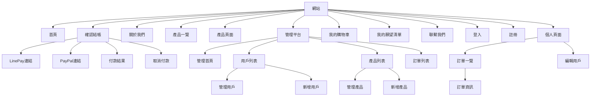

# ecommerce-website
練習製作電商網站，前端react，後端node.js 
[網站部署(heroku)](https://hsinyaoecommercewebsite.herokuapp.com/)

```mermaid
graph TD;
    網站-->首頁;
    網站-->管理平台;
    網站-->關於我們;
    網站-->產品一覽;
    網站-->產品頁面
    網站-->個人頁面;
    網站-->我的購物車;
    網站-->我的願望清單;
    網站-->聯繫我們;
    網站-->登入;
    網站-->註冊;
    網站-->確認結帳;
    確認結帳-->LinePay連結;
    確認結帳-->PayPal連結;
    確認結帳-->付款結果;
    確認結帳-->取消付款;
    管理平台-->管理首頁;
    管理平台-->用戶列表;
    管理平台-->產品列表;
    管理平台-->訂單列表;
    用戶列表-->管理用戶;
    用戶列表-->新增用戶;
    產品列表-->管理產品;
    產品列表-->新增產品;
    個人頁面-->訂單一覽;
    個人頁面-->編輯用戶;
    訂單一覽-->訂單資訊;
    
    
```
